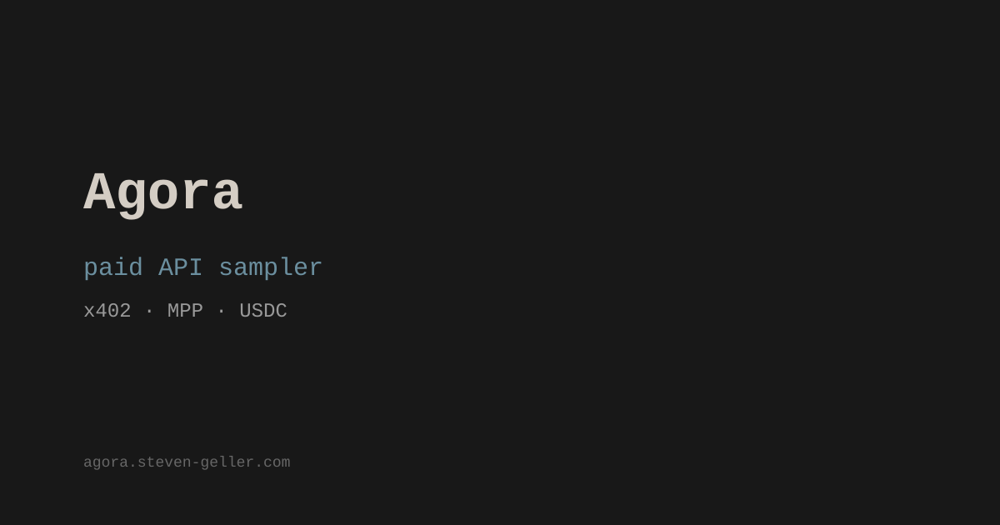

# Agora

Paid API sampler comparing two protocols fighting to own machine-to-machine payments: **x402** (Coinbase, crypto-native) and **MPP** (Stripe/IETF, fiat-native).

Live at [agora.steven-geller.com](https://agora.steven-geller.com)



## What This Is

Agora serves four micro-endpoints (haiku, quote, fact, torus glyph) behind HTTP 402 paywalls. Each endpoint is available through both payment protocols, so you can compare the handshake flows side by side.

The web UI walks through every step of each protocol's challenge-response cycle, from initial request through payment to content delivery. Every transaction settles on a real blockchain.

### x402 (Coinbase)

Full [x402 v2](https://www.x402.org) implementation using the official `x402-axum` middleware. Payments settle on-chain via ERC-3009 `TransferWithAuthorization` on Base (USDC), verified by the x402.org facilitator.

The server returns a 402 with a proprietary `Payment-Required` header containing a base64-encoded JSON blob. The client constructs a `Payment-Signature` header with a signed EIP-712 payload and retries.

- Testnet: `/test/*` (Base Sepolia, eip155:84532)
- Mainnet: `/api/*` (Base, eip155:8453)

### MPP (Stripe / IETF)

Implementation of the [Machine Payments Protocol](https://mpp.dev) per IETF [draft-ryan-httpauth-payment](https://datatracker.ietf.org/doc/draft-ryan-httpauth-payment/). Payments settle on Tempo using pathUSD, with on-chain receipt verification.

The server returns a 402 with a standard `WWW-Authenticate: Payment` header containing an HMAC-bound challenge. The client sends a real on-chain pathUSD transfer, then retries with an `Authorization: Payment` credential containing the transaction hash as proof. The server verifies the receipt directly on-chain, no facilitator needed.

- Testnet: `/mpp/*` (Tempo Moderato, chain 42431)
- Mainnet: `/mpp-mainnet/*` (Tempo, chain 4217)

## Architecture

```
                         ┌─────────────────────────────┐
                         │     Caddy reverse proxy      │
                         │     agora.steven-geller.com  │
                         └──────────┬──────────────────┘
                                    │
                         ┌──────────▼──────────────────┐
                         │     Axum server (:3033)      │
                         │                              │
                         │  /test/*        x402 testnet │
                         │  /api/*         x402 mainnet │
                         │  /mpp/*         MPP testnet  │
                         │  /mpp-mainnet/* MPP mainnet  │
                         │  /demo/*        buyer proxy  │
                         │  /.well-known/x402 discovery │
                         └──────────┬──────────────────┘
                                    │
              ┌─────────────────────┼─────────────────────┐
              │                     │                     │
    ┌─────────▼────────┐ ┌─────────▼────────┐ ┌──────────▼───────┐
    │ x402.org         │ │ Base Sepolia /   │ │ Tempo Moderato / │
    │ facilitator      │ │ Base mainnet     │ │ Tempo mainnet    │
    └──────────────────┘ └──────────────────┘ └──────────────────┘
```

**`src/main.rs`** — Axum server, x402 middleware integration, demo buyer proxy, content endpoints, rate limiting, health checks, graceful shutdown

**`src/mpp.rs`** — MPP protocol: HMAC-bound challenge generation via `WWW-Authenticate: Payment`, credential verification via `Authorization: Payment`, on-chain receipt validation, RLP-encoded Tempo transactions, disk-persisted replay protection

**`static/`** — Single-page frontend with step-by-step flow visualization

### Operational

- **Structured logging** via `tracing` with `RUST_LOG` env filter (default: `info`)
- **Health endpoint** at `GET /health` for monitoring and reverse proxy checks
- **Graceful shutdown** on SIGTERM/SIGINT with in-flight request draining
- **Panic recovery** via `CatchPanicLayer` — handler panics return 500 instead of dropping connections
- **CI** via GitHub Actions (clippy, rustfmt, build)

## Setup

### Prerequisites

- Rust 1.75+
- A funded wallet on Base Sepolia (for x402) and/or Tempo Moderato (for MPP)

### Get Testnet Tokens

- USDC on Base Sepolia: [faucet.circle.com](https://faucet.circle.com/) (select Base Sepolia)
- ETH for gas on Base Sepolia: [faucet.quicknode.com/base/sepolia](https://faucet.quicknode.com/base/sepolia)
- pathUSD on Tempo Moderato: [tempo.xyz faucet](https://docs.tempo.xyz)

### Configure

```bash
cp .env.example .env
# Edit .env with your wallet key and seller address
```

### Build and Run

```bash
cargo build --release
source .env && ./target/release/agora
```

The server starts on `127.0.0.1:3033`. For production, put it behind a reverse proxy (Caddy, nginx) with TLS.

### systemd (production)

```ini
[Unit]
Description=Agora paid API sampler
After=network.target

[Service]
Type=simple
WorkingDirectory=/home/user/agora
ExecStart=/home/user/agora/target/release/agora
Environment=SELLER_ADDRESS=0x...
Environment=BUYER_PRIVATE_KEY=0x...
Environment=MPP_SECRET=your-secret-here
Environment=PRICE_USDC=0.001
Restart=on-failure

[Install]
WantedBy=multi-user.target
```

## API Reference

### Discovery

```
GET /.well-known/x402
```

Returns JSON with supported protocols, networks, endpoints, and pricing.

### Paid Endpoints

| Path | Protocol | Content |
|------|----------|---------|
| `GET /test/haiku` | x402 v2 (testnet) | Random tech haiku |
| `GET /test/quote` | x402 v2 (testnet) | Programming quote |
| `GET /test/fact` | x402 v2 (testnet) | Technical fact |
| `GET /test/torus` | x402 v2 (testnet) | Torus logographic symbol |
| `GET /api/haiku` | x402 v2 (mainnet) | Same content, real USDC |
| `GET /api/quote` | x402 v2 (mainnet) | Same content, real USDC |
| `GET /api/fact` | x402 v2 (mainnet) | Same content, real USDC |
| `GET /api/torus` | x402 v2 (mainnet) | Same content, real USDC |
| `GET /mpp/haiku` | MPP (testnet) | Same content, pathUSD |
| `GET /mpp/quote` | MPP (testnet) | Same content, pathUSD |
| `GET /mpp/fact` | MPP (testnet) | Same content, pathUSD |
| `GET /mpp/torus` | MPP (testnet) | Same content, pathUSD |
| `GET /mpp-mainnet/haiku` | MPP (mainnet) | Same content, real pathUSD |
| `GET /mpp-mainnet/quote` | MPP (mainnet) | Same content, real pathUSD |
| `GET /mpp-mainnet/fact` | MPP (mainnet) | Same content, real pathUSD |
| `GET /mpp-mainnet/torus` | MPP (mainnet) | Same content, real pathUSD |

All endpoints return JSON. Without payment, they return HTTP 402 with protocol-specific challenge headers.

### Demo Buyer

For testing without your own wallet:

```bash
# x402 testnet
curl -s -X POST https://agora.steven-geller.com/demo/purchase \
  -H 'Content-Type: application/json' \
  -d '{"endpoint":"haiku","protocol":"x402-testnet"}'

# MPP testnet
curl -s -X POST https://agora.steven-geller.com/demo/purchase \
  -H 'Content-Type: application/json' \
  -d '{"endpoint":"haiku","protocol":"mpp-testnet"}'
```

Returns the full step-by-step handshake as JSON.

## Agent Integration

See [AGENTS.md](AGENTS.md) for complete integration guides with code examples in Rust, JavaScript, and curl for both protocols.

See [agents.txt](static/agents.txt) (also served at `/agents.txt`) for the machine-readable version.

## Protocol Comparison

| | x402 v2 | MPP |
|---|---|---|
| **Spec** | [x402.org](https://www.x402.org) | [IETF draft-ryan-httpauth-payment](https://datatracker.ietf.org/doc/draft-ryan-httpauth-payment/) |
| **402 header** | `Payment-Required` (base64 JSON, proprietary) | `WWW-Authenticate: Payment` (RFC 9110 auth params) |
| **Client header** | `Payment-Signature` (base64 payload) | `Authorization: Payment` (base64url credential) |
| **Receipt** | `X-Payment-Response` | `Payment-Receipt` |
| **Settlement** | Facilitator settles on-chain (Base USDC) | Client settles directly on-chain (Tempo pathUSD) |
| **Verification** | Delegated to facilitator | Server verifies on-chain receipt directly |
| **Identity** | Wallet address | DID / wallet address |
| **Challenge binding** | None (facilitator tracks nonces) | HMAC-SHA256 bound to server |
| **Replay protection** | Facilitator-managed | Server-side consumed tx hash set |
| **Rust SDK** | [x402-rs](https://github.com/coinbase/x402) (mature) | [mpp-rs](https://github.com/tempoxyz/mpp-rs) (new) |
| **JS SDK** | [@x402/fetch](https://www.npmjs.com/package/@x402/fetch) (mature) | [mppx](https://www.npmjs.com/package/mppx) (new) |

## Known Limitations

See [TRADEOFFS.md](TRADEOFFS.md) for documented trade-offs and planned improvements.

## License

[MIT](LICENSE)
